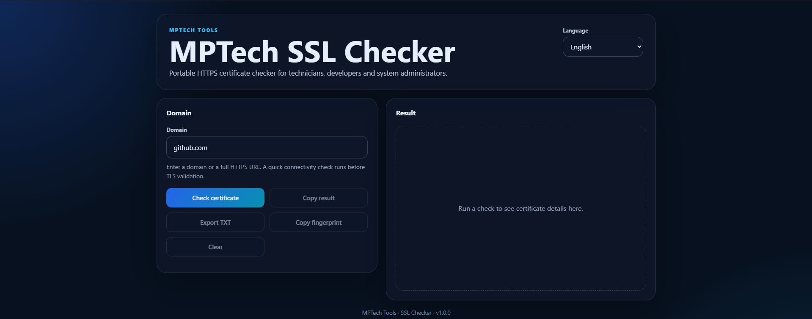
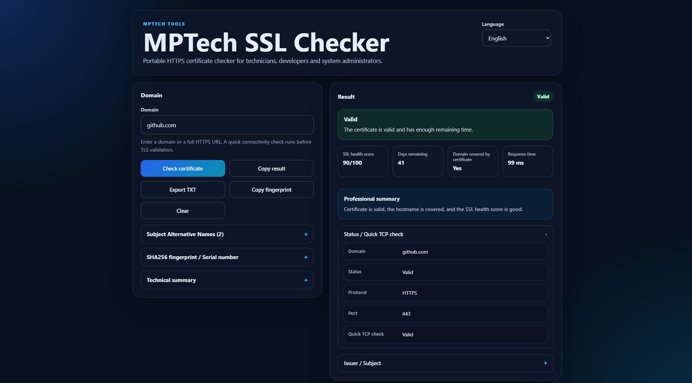
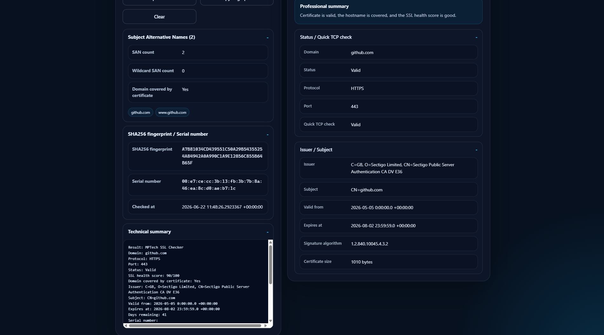
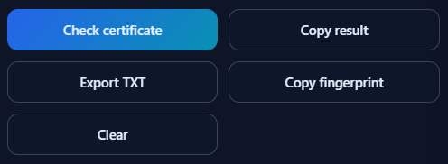

# MPTech SSL Checker

Ferramenta portátil para Windows que permite verificar certificados HTTPS/TLS, estado SSL e cobertura do domínio.

## Download

Descarrega o executável portátil a partir do GitHub Releases:

- Repositório: https://github.com/xml2811/SSL-Checker
- Última release: https://github.com/xml2811/SSL-Checker/releases/latest

Ficheiro recomendado:

**MPTech-SSL-Checker-v1.0.0-portable.exe**

A versão portátil não requer instalação.

## O que faz

MPTech SSL Checker é uma pequena ferramenta técnica de ambiente de trabalho para verificar certificados HTTPS rapidamente no Windows.

Foi pensada para técnicos, administradores de sistemas, programadores, estudantes de IT e utilizadores avançados que precisam de verificar o estado de um certificado sem abrir várias ferramentas diferentes.

## Funcionalidades

- Validação de certificados HTTPS/TLS.
- Normalização de domínios a partir de domínio simples ou URL HTTPS completa.
- Verificação TCP rápida antes da validação TLS.
- Data de expiração e dias restantes.
- Pontuação de saúde SSL.
- Verificação de cobertura do domínio pelo certificado.
- Deteção de SANs e SANs wildcard.
- Emissor e sujeito do certificado.
- Impressão SHA256.
- Número de série do certificado.
- Algoritmo de assinatura.
- Tamanho do certificado.
- Tempo de resposta.
- Deteção do tipo de erro: DNS, TCP, TLS, certificado ou desconhecido.
- Copiar resultado completo para a área de transferência.
- Copiar impressão do certificado.
- Exportar relatório TXT escolhendo onde guardar.
- Interface limpa com secções técnicas expansíveis.
- Interface multilingue: inglês, espanhol e português.
- Sem login, sem backend, sem base de dados e sem guardar segredos.

## Capturas

### Vista principal

### Resultado

### Detalhes SSL

### Exportar TXT

## Exemplos de teste

Podes testar domínios como:

- google.com
- github.com
- expired.badssl.com
- self-signed.badssl.com
- wrong.host.badssl.com

## Privacidade

MPTech SSL Checker apenas se liga ao endpoint HTTPS introduzido pelo utilizador e lê o certificado TLS público.

Não guarda credenciais, palavras-passe, chaves privadas, cookies, contas ou segredos.

## Notas

O Windows SmartScreen pode mostrar um aviso porque o executável ainda não está assinado com certificado de código.

## Stack técnico

- Tauri 2
- React
- TypeScript
- Rust
- Vite
- Native TLS
- Análise de certificados X509

## Distribuição

Os executáveis finais são distribuídos através do GitHub Releases.

O ficheiro .exe não é guardado dentro da árvore do repositório.

## Licença

Este projeto tem código visível para uso pessoal, educativo e não comercial.

Não é permitida a revenda, redistribuição comercial ou utilização dentro de produtos/serviços pagos sem autorização prévia por escrito.

Consulta [LICENSE](LICENSE).

## Autor

Criado por Xavier Madrid Lerga sob MPTech Tools.

GitHub: https://github.com/xml2811